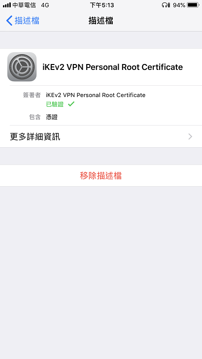
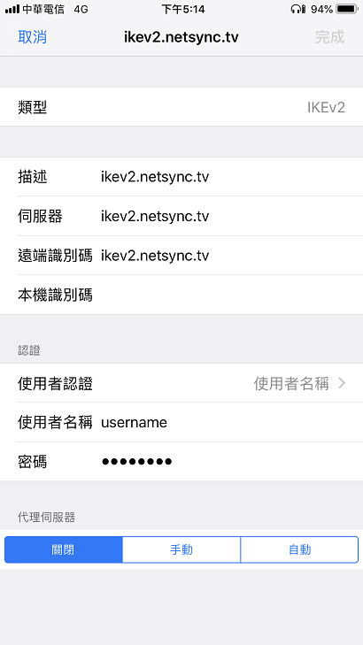

# Table of content
 
   * [Ubuntu CLI notes](#ubuntu-cli-notes)
      * [Headless](#headless)
         * [General](#general)
         * [debootstrap](#debootstrap)
         * [nfs, samba, avaiha](#nfs-samba-avaiha)
         * [Static IP](#static-ip)
         * [Hostname](#hostname)
         * [Hinet VDSL PPPoE with ipv6 dual stack](#hinet-vdsl-pppoe-with-ipv6-dual-stack)
         * [SSH server public key authentication configure](#ssh-server-public-key-authentication-configure)
         * [SSHFS](#sshfs)
         * [Change time zone to UTC](#change-time-zone-to-utc)
         * [Samba Configure](#samba-configure)
         * [NFS Configure](#nfs-configure)
         * [Fix user 'xxxx' not in the sudoers file](#fix-user-xxxx-not-in-the-sudoers-file)
      * [Development](#development)
         * [General](#general-1)
         * [libdrm-dev](#libdrm-dev)
         * [32bit dev](#32bit-dev)
         * [AOSP dev](#aosp-dev)
         * [SDL2 dev](#sdl2-dev)
         * [SDL2 runtime](#sdl2-runtime)
         * [ffmpeg dev](#ffmpeg-dev)
         * [OpenGL Headers](#opengl-headers)
         * [wpa_supplicant-2.7 building](#wpa_supplicant-27-building)
      * [Desktop](#desktop)
         * [general](#general-2)
         * [x11vnc](#x11vnc)
      * [Docker](#docker)
         * [General](#general-3)
         * [Basic CLI](#basic-cli)
         * [iptables rules for DOCKER-USER chain](#iptables-rules-for-docker-user-chain)
         * [Docker Compose](#docker-compose)
      * [Gitlab on Docker Engine](#gitlab-on-docker-engine)
         * [General](#general-4)
         * [Enter the gitlab conatiner and modify the custom configure](#enter-the-gitlab-conatiner-and-modify-the-custom-configure)
         * [Configure for standalone gitlab server](#configure-for-standalone-gitlab-server)
         * [Configure for gitlab server behind the reverse proxy](#configure-for-gitlab-server-behind-the-reverse-proxy)
         * [References](#references)
      * [Example of docker-compose.yml](#example-of-docker-composeyml)
      * [Coturn TURN Server docker image](#coturn-turn-server-docker-image)
      * [Conan C/C++ package manager](#conan-cc-package-manager)
         * [jfrog server setup](#jfrog-server-setup)
         * [client account setup](#client-account-setup)
         * [Basic CLI](#basic-cli-1)
      * [為移動而生的 VPN =&gt; iKEv2](#\xE7\x82\xBA\xE7\xA7\xBB\xE5\x8B\x95\xE8\x80\x8C\xE7\x94\x9F\xE7\x9A\x84-vpn--ikev2)
         * [Strongswan + iKEv2 + EAP 一鍵安裝腳本](#strongswan--ikev2--eap-\xE4\xB8\x80\xE9\x8D\xB5\xE5\xAE\x89\xE8\xA3\x9D\xE8\x85\xB3\xE6\x9C\xAC)
            * [StrongSwan 與其相依軟件](#strongswan-\xE8\x88\x87\xE5\x85\xB6\xE7\x9B\xB8\xE4\xBE\x9D\xE8\xBB\x9F\xE4\xBB\xB6)
            * [RootCA X509 憑證](#rootca-x509-\xE6\x86\x91\xE8\xAD\x89)
            * [iKEv2 VPN Server X509 憑證](#ikev2-vpn-server-x509-\xE6\x86\x91\xE8\xAD\x89)
            * [設定 /etc/ipsec.conf](#\xE8\xA8\xAD\xE5\xAE\x9A-etcipsecconf)
            * [設定 /etc/ipsec.secrets](#\xE8\xA8\xAD\xE5\xAE\x9A-etcipsecsecrets)
            * [設定 設定 /etc/strongswan.conf](#\xE8\xA8\xAD\xE5\xAE\x9A-\xE8\xA8\xAD\xE5\xAE\x9A-etcstrongswanconf)
            * [設定 /etc/network/if-up.d/iptables](#\xE8\xA8\xAD\xE5\xAE\x9A-etcnetworkif-updiptables)
            * [loading EAP_MSCHAPV2 method failed](#loading-eap_mschapv2-method-failed)
         * [iOS 14 iKEv2 客戶端設定](#ios-14-ikev2-\xE5\xAE\xA2\xE6\x88\xB6\xE7\xAB\xAF\xE8\xA8\xAD\xE5\xAE\x9A)
            * [RootCA X509 憑證](#rootca-x509-\xE6\x86\x91\xE8\xAD\x89-1)
            * [設定 iKEv2 客戶端](#\xE8\xA8\xAD\xE5\xAE\x9A-ikev2-\xE5\xAE\xA2\xE6\x88\xB6\xE7\xAB\xAF)
         * [Windows 10 iKEv2 客戶端設定](#windows-10-ikev2-\xE5\xAE\xA2\xE6\x88\xB6\xE7\xAB\xAF\xE8\xA8\xAD\xE5\xAE\x9A)
            * [增加 ikev2_rootca.crt 憑證](#\xE5\xA2\x9E\xE5\x8A\xA0-ikev2_rootcacrt-\xE6\x86\x91\xE8\xAD\x89)
            * [設定 iKEv2 連線](#\xE8\xA8\xAD\xE5\xAE\x9A-ikev2-\xE9\x80\xA3\xE7\xB7\x9A)
            * [增加 10.10.10.0 到路由表](#\xE5\xA2\x9E\xE5\x8A\xA0-1010100-\xE5\x88\xB0\xE8\xB7\xAF\xE7\x94\xB1\xE8\xA1\xA8)
         * [參考網頁](#\xE5\x8F\x83\xE8\x80\x83\xE7\xB6\xB2\xE9\xA0\x81)
 
# Ubuntu CLI notes
## Headless
### General

Install

```bash
sudo apt-get install nload tmux vim sudo wget curl ca-certificates xz-utils net-tools --no-install-recommends
```

---------------------------------
### debootstrap 

Install 

```bash
apt-get install  qemu-utils qemu qemu-user-static binfmt-support fakechroot debootstrap gperf help2man --no-install-recommends
```

---------------------------------
### nfs, samba, avaiha 

Install 

```bash
sudo apt-get install nfs-common nfs-kernel-server portmap cifs-utils avahi-daemon samba --no-install-recommends
```

List of nfs-server using port (some port would be cated dynamic)

```bash
rpcinfo -p | awk '{print $3" "$4}' | sort -k2n | uniq
```

Fixed the NFS-Server port

[https://wiki.ubuntu.com/How%20to%20get%20NFS%20working%20with%20Ubuntu-CE-Firewall]

Configure avahi-daemon `sudo vim.tiny /etc/avahi/avahi-daemon.conf`

```bash
[server]
host-name=debser
domain-name=local
```

Enable and restart

```bash
sudo systemctl enable avahi-daemon
sudo systemctl reart avahi-daemon
```

and then you can `ping debser.local` from windows after you installed the ITunes(mDNS).


---------------------------------

### Static IP

Edit 

```bash
/etc/network/interfaces
```

From

```bash
allow-hotplug ens33
iface ens33 inet dhcp
```

To

```bash
allow-hotplug ens33
auto ens33
iface ens33 inet static
address 192.168.4.14
netmask 255.255.255.0
gateway 192.168.4.1
```

Restart networking

```bash
sudo systemctl restart networking.service
sudo systemctl restart network-manager.service
```


---------------------------------

### Hostname

Change `deb9ser` as you want.

```bash
sudo hostnamectl set-hostname deb9ser
```

---------------------------------

### Hinet VDSL PPPoE with ipv6 dual stack

Make sure the followings line has been comments in `/etc/sysctl.conf`
    
```bash
#net.ipv6.conf.all.disable_ipv6 = 1
#net.ipv6.conf.default.disable_ipv6 = 1
#net.ipv6.conf.lo.disable_ipv6 = 1
#net.ipv6.conf.eth0.disable_ipv6 = 1
```
    
Append the following line to `/etc/ppp/option`
    
```bash
+ipv6 ipv6cp-use-ipaddr
```
    
Install PPPoE
    
```bash
sudo apt-get install pppoe pppoeconf
```

PPPoE Setup
    
```bash
sudo pppoeconf
```
    
PPPoE Default Routing
    
edit `/etc/ppp/peers/dsl-provider` and add the `replacedefaultroute ` to the line after `defaultroute`. It will be something like this.
    
```bash
# Use this connection as the default route.
# Comment out if you already have the correct default route installed.
defaultroute
replacedefaultroute
```
    
PPPoE Stop
    
```bash
sudo poff dsl-provider
```

PPPoE Sart
    
```bash
sudo pon dsl-provider
```
    
Get ipv6 address from curl

```bash
curl ifconfig.co
```
    
(Optional) Append ipv6 dns server to `/etc/resolv.conf`

```bash
nameserver 2001:b000:168::1
nameserver 2001:b000:168::2
```
    
(Optional) Disable enp4s0, enp0s31f6 public IPv6 address, only let IPv6 go throw intetnet by ppp0

Due to curretnly the Hinet VDSL has been assign public IPv6 address automaticlly to Ethernet. But, acconding our setting above, we set the default route to ppp0, this will make IPv6 go throw internet by Ethernet and IPv4 go throw internet by ppp0. This seen make some something confused. 

So here the following setting could be disable ethernet to obtain the public IPv6 address and still make IPv6 go throw internet by ppp0. 
    
```bash
# add the following line to /etc/sysctl.conf and then sysctl -p
net.ipv6.conf.enp4s0.disable_ipv6 = 1
net.ipv6.conf.enp0s31f6.disable_ipv6 = 1
```

---------------------------------

### SSH server public key authentication configure

Client: Generate the RSA public key, private key pair in the client side

The following command will generate RSA private key to `~/.ssh/ida_rsa` and RSA public key to `~/.ssh/ida_rsa.pub`

```bash
ssh-keygen -t rsa
```

Server: Append the client side's `~/.ssh/ida_rsa.pub` to server side's `~/.ssh/authorized_keys`. The server's account is which you would like to login from client side. The client's account is which you would like to connect to.

chmod to 600
    
```bash
chmod 600 ~/.ssh/authorized_keys
```
    
Server: Modified the `/etc/ssh/sshd_config` to look like as

```bash
PermitRootLogin without-password
AuthorizedKeysFile      .ssh/authorized_keys
ChallengeResponseAuthentication no
PasswordAuthentication no
```
    
and
    
```bash
/etc/init.d/ssh restart
```
    
Use the `ida_rsa.pub` public key from PuTTY

[use-ssh-keys-with-putty-on-windows](https://devops.profitbricks.com/tutorials/use-ssh-keys-with-putty-on-windows/)
    
    
---------------------------------
	
### SSHFS

If the ssh server is ready, then no need to do anything from server side. The followings command is for client side.

```bash
sudo apt-get install sshfs
```

Edit `sudo vim.tiny /etc/fuse.conf` and uncomment the followings line if you would like to running `sudo` over sshfs disk.

```bash
user_allow_other
```

Mounting SSHFS

```bash
sshfs -o allow_root dogi@IP:/opt/workspace /opt/workspace
```

Unmount

```bash
fusermount -u /opt/workspace_vm
```

If this way can work, then totally can instead of NFS Sucks. 
 <https://www.kernel.org/doc/ols/2006/ols2006v2-pages-59-72.pdf>
    
---------------------------------

### Change time zone to UTC

Configure

```bash
sudo dpkg-reconfigure tzdata
```

---------------------------------

### Samba Configure

Edit `/etc/samba/smb.conf`  

```bash
[global]
  allow insecure wide links = yes
```

Sharing `/opt` to the user of `user` 

```bash
[opt]
   comment = opt
   path = /opt
   browseable = yes
   read only = no
   create mask = 0644
   directory mask = 0755
   valid users = USER
   force user = root
   force group = root
   admin users = dogi
   follow symlinks = yes
   wide links = yes
   oplocks = no
```
    
Sharing `/home/%S` directory to the user of `%S`

```bash
[homes]
   comment = Home Directories
   browseable = yes
   read only = no
   create mask = 0700
   directory mask = 0700
   valid users = %S
   follow symlinks = yes
   wide links = yes
   oplocks = no
```
    
Add user of `user` to samba server's list

```bash
useradd -m -d /home/user user
smbpasswd -a user
```
    
Restart samba server

```bash
useradd -m -d /home/user user
smbpasswd -a user
```
    
Start samba server after system boot-up

```bash
systemctl enable smbd
```
    
	
---------------------------------

### NFS Configure 

Sharing `/opt`. Edit `/etc/exports` to 

```bash
/opt   *(rw,insecure,fsid=0,async,no_root_squash,no_subtree_check)
```
    
Restart nfs server 

```bash
/etc/init.d/nfs-kernel-server restart
```
    
Start nfs server after system boot-up 

```bash
systemctl enable nfs-kernel-server
```
    
---------------------------------

### Fix user 'xxxx' not in the sudoers file

As root and run 

```bash
visudo
```
    
Append the file with

```bash
username	ALL=(ALL) ALL
```
---------------------------------

## Development
### General

Install

```bash
sudo apt-get install build-essential fakeroot automake flex texinfo autoconf bison gawk libtool libtool-bin libncurses5-dev git yasm --no-install-recommends
```

---------------------------------

### libdrm-dev

Install

```bash
sudo apt install libgl1-mesa-dev libdrm-dev libegl1-mesa-dev
```

---------------------------------

### 32bit dev

Install

```bash
sudo apt-get install lib32z1 gcc-multilib rpm lib32stdc++6 lib32ncurses5 --no-install-recommends
```

---------------------------------

### AOSP dev

Install

```bash
sudo apt-get install git-core gnupg flex bison gperf build-essential zip curl zlib1g-dev gcc-multilib g++-multilib libc6-dev-i386 lib32ncurses5-dev x11proto-core-dev libx11-dev lib32z-dev libgl1-mesa-dev libxml2-utils xsltproc unzip openjdk-8-jdk
```

---------------------------------

### SDL2 dev

Install

```bash
sudo apt-get install libsdl2-dev libsdl2-gfx-dev libsdl2-image-dev libsdl2-mixer-dev libsdl2-net-dev libsdl2-ttf-dev libcurl4-openssl-dev libjansson-dev libyaml-dev
```

---------------------------------


### SDL2 runtime

Install

```bash
sudo apt-get install libsdl2-2.0 libsdl2-gfx-1.0 libsdl2-image-2.0 libsdl2-mixer-2.0 libsdl2-net-2.0 libsdl2-ttf-2.0 libcurl4 libjansson4 libyaml-0-2
```

---------------------------------

### ffmpeg dev

Install

```bash
sudo apt-get install libavcodec-dev libavformat-dev libavdevice-dev libavfilter-dev libavutil-dev libswresample-dev libswscale-dev
```

---------------------------------

### OpenGL Headers

Install these things before install nVidia GPU driver.

```bash
sudo apt-get install libgl1-mesa-dev libgles2-mesa-dev 
```


---------------------------------

### wpa_supplicant-2.7 building

Install

```bash
sudo apt-get install dbus libdbus-1-3 libxml2-dev libssl-dev
```

and building by enter

```bash
cd wpa_supplicant

echo "CONFIG_BUILD_WPA_CLIENT_SO=y" >> .config
make -j4
sudo make LIBDIR=/usr/lib install
```

The `/usr/lib/libwpa_client.so` and `/usr/local/include/wpa_ctrl.h` will installed.

---------------------------------

## Desktop
### general

Install

```bash
sudo apt-get install ntfs-3g freerdp aptitude vim-gtk3 firmware-misc-nonfree vnc4server lm-sensors linux-headers-4.x.x.x-amd64 --no-install-recommends
```

---------------------------------

### x11vnc

Install

```bash
sudo apt-get install x11vnc
```

Set default password for current user.

```bash
x11vnc -storepasswd
```

Start x11vnc command

```bash
/usr/bin/x11vnc -auth guess -forever -loop -noxdamage -repeat -rfbauth /home/YOUR_USER_NAME/.vnc/passwd -rfbport 5900 -shared
```

Use VNC Viewer for client connection

```bash
IP:5900
```
 ---------------------------------

## Docker
### General

Unstall legacy

```bash
sudo apt-get remove docker docker-engine docker.io containerd runc
```

Add trust URL

```bash
sudo apt-get update
sudo apt-get install \
  apt-transport-https \
  ca-certificates \
  curl \
  gnupg-agent \
  software-properties-common
curl -fsSL https://download.docker.com/linux/ubuntu/gpg | sudo apt-key add -
sudo apt-key fingerprint 0EBFCD88
sudo add-apt-repository \
 "deb [arch=amd64] https://download.docker.com/linux/ubuntu \
 $(lsb_release -cs) \
 stable"
```

Install

```bash
sudo apt-get install docker-ce docker-ce-cli containerd.io
```

Change default conatiner storage path.  Edit `/etc/docker/daemon.json`

```bash
{
  "graph":"/opt/docker"
}
```

---------------------------------

### Basic CLI
 
Search image from Command line
  
```bash
sudo docker search ubuntu
```
    
See the tagged ubuntu images from dockerhub site
  
```bash
https://hub.docker.com/_/ubuntu/?tab=tags&page=1&ordering=last_updated
```

Pull a ubuntu-20.04 image from docker hub
  
```bash
sudo docker pull ubuntu:20.04
```
    
Remove image
  
```bash
sudo docker rm ubuntu:20.04
```
    
List installed images
  
```bash
sudo docker images -a
```
    
Run the ubuntu-20.04 image
  
```bash
sudo docker run -itd --privileged=true --net=host -v /opt:/opt --name=ubuntu2004 ubuntu:20.04 
```
    
List the running container

```bash
sudo docker ps -a
```

Attach the running container 

```bash
sudo docker attach ubuntu2004/container_id
```

I.E. detach current container without stopping. use the escape sequence Ctrl+P -> followed by Ctrl+Q.

Stop/Start/Remove the container
  
```bash
sudo docker stop/start/rm ubuntu2004/container_id
```

---------------------------------

### iptables rules for DOCKER-USER chain

Make sure container should not expose to the internet. Change `192.168.1.0/24` as your lan address

```bash
# Create DOCKER-USER Chain
iptables -N DOCKER-USER

#DOCKER-USER Rules
iptables -A DOCKER-USER -i docker0 -j ACCEPT
iptables -A DOCKER-USER -i docker0 -o eth0 -j ACCEPT
iptables -A DOCKER-USER -m conntrack --ctstate RELATED,ESTABLISHED -j ACCEPT
iptables -A DOCKER-USER -j RETURN -s 172.18.0.0/16

# Accept incoming address where from 192.168.1.0/24 
$iptables -A DOCKER-USER -s 192.168.1.0/24 -j ACCEPT

# Reject everything
$iptables -A DOCKER-USER -j REJECT
```

References

  1. [Install Docker Engine on Ubuntu](https://docs.docker.com/engine/install/ubuntu/)
  1. [Docker Hub Ubuntu tag list](https://hub.docker.com/_/ubuntu/?tab=tags&page=1&ordering=last_updated)
  1. [Docker 初學筆記 - 基本指令操作教學](https://blog.longwin.com.tw/2017/01/docker-learn-initial-command-cheat-sheet-2017/)


---------------------------------

### Docker Compose 

Install

```bash
sudo curl -L "https://github.com/docker/compose/releases/download/1.27.4/docker-compose-$(uname -s)-$(uname -m)" -o /usr/local/bin/docker-compose
```

Apply executable permissions 
 
```bash
sudo chmod +x /usr/local/bin/docker-compose
```

References
  1. [Install Docker Compose](https://docs.docker.com/compose/install/)


---------------------------------

## Gitlab on Docker Engine
### General

Export  `GITLAB_HOME` system variable

```bash
export GITLAB_HOME=/opt/gitlab
```

Pull offical gitlab docker image

```bash
sudo docker pull gitlab/gitlab-ce:13.7.0-rc3.ce.0
```

Run the gitlab container

```bash
sudo docker run -itd \
--hostname yourname \
-p 443:443 \
--name gitlab \
--restart always \
--volume $GITLAB_HOME/config:/etc/gitlab \
--volume $GITLAB_HOME/logs:/var/log/gitlab \
--volume $GITLAB_HOME/data:/var/opt/gitlab \
gitlab/gitlab-ce:13.7.0-rc3.ce.0
```

"--restart always" is means auto start the container after docker engine was boot-up. 

---------------------------------

### Enter the gitlab conatiner and modify the custom configure

Login into the gitlab container 

```bash
sudo docker exec -it gitlab /bin/bash
```

Edit /etc/gitlab/gitlab.rb to make you custom settings.

```bash
vim /etc/gitlab/gitlab.rb
```

reload configure

```bash
gitlab-ctl reconfigure
```

quit the gitlab container

```bash
Ctrl +P, Ctrl + Q
```

---------------------------------

### Configure for standalone gitlab server

Copy the custom cert and key 

```bash
sudo mkdir -p /etc/gitlab/config/ssl
sudo chmod 755 /etc/gitlab/config/ssl
sudo cp yourname.crt /etc/gitlab/config/ssl/
sudo cp yourname.key /etc/gitlab/config/ssl/
```

Edit the `/etc/gitlab/gitlab.rb` and then

```bash
external_url 'https://yourdomain.com'
nginx['redirect_http_to_https'] = true
nginx['ssl_certificate'] = "/etc/gitlab/ssl/yourname.crt"
nginx['ssl_certificate_key'] = "/etc/gitlab/ssl/yourname.key"
```

---------------------------------

### Configure for gitlab server behind the reverse proxy

The settings is means that expose 80 port to reverse proxy, but gitlab still redirect URL to 'https://yourdomain.com'

Ref: [https://docs.gitlab.com/omnibus/settings/nginx.html#supporting-proxied-ssl]

Edit the `/etc/gitlab/gitlab.rb` 

```bash
external_url 'https://yourdomain.com'
nginx['redirect_http_to_https'] = false
nginx['listen_port'] = 80
nginx['listen_https'] = false
```

---------------------------------

### References

* [Gitlab-CE dokcer image](https://hub.docker.com/r/gitlab/gitlab-ce/tags?page=1&ordering=last_updated)
* [Install GitLab using Docker Engine](https://docs.gitlab.com/omnibus/docker/#install-gitlab-using-docker-engine)
* [Manually configuring HTTPS](https://docs.gitlab.com/omnibus/settings/nginx.html#manually-configuring-https)
* [Add iptables policies before Docker’s rules](https://docs.docker.com/network/iptables/#add-iptables-policies-before-dockers-rules)

---------------------------------

## Example of docker-compose.yml 

For following docker image
1. Nginx
2. Gitlab
3. portainer

```bash
version: "3.8"
services:
  nginx:
    image: nginx:1.19.5
    privileged: true
    network_mode: "host"
    restart: always
    volumes:
      - _NGINX_PATH_/nginx.conf:/etc/nginx/nginx.conf
      - _NGINX_PATH_/ssl:/etc/nginx/ssl
      - _NGINX_PATH_/conf.d:/etc/nginx/conf.d
  gitlab:
    image: gitlab/gitlab-ce:13.7.0-rc3.ce.0
    ports:
      - '3000:80'
    restart: always
    volumes:
      - _GITLAB_HOME_/config:/etc/gitlab
      - _GITLAB_HOME_/logs:/var/log/gitlab
      - _GITLAB_HOME_/data:/var/opt/gitlab
  portainer:
    image: portainer/portainer-ce:2.0.0
    ports:
      - '9000:9000'
    restart: always
    volumes:
      - /var/run/docker.sock:/var/run/docker.sock
      - _PORTAINER_PATH_:/data
```

bring up command

```bash
sudo cat docker-compose.yml.template | \
sed "s@_NGINX_PATH_@${NGINX_PATH}@g" |\
sed "s@_GITLAB_HOME_@${GITLAB_HOME}@g" |\
sed "s@_PORTAINER_PATH_@${PORTAINER_PATH}@g" \
> /tmp/docker-compose.yml
sudo docker-compose -f /tmp/docker-compose.yml up -d
```

The above docker-compose.yml would be equal to

```bash
#!/bin/bash
_gitlab_run() {
  sudo docker run -itd \
  -p 3001:3001 \
  --name gitlab \
  --restart always \
  --volume $GITLAB_HOME/config:/etc/gitlab \
  --volume $GITLAB_HOME/logs:/var/log/gitlab \
  --volume $GITLAB_HOME/data:/var/opt/gitlab \
  gitlab/gitlab-ce:13.7.0-rc3.ce.0
}

_portainer_run() {
  sudo docker run -itd \
  -p 9000:9000 \
  --name=portainer \
  --restart=always \
  -v /var/run/docker.sock:/var/run/docker.sock \
  -v ${PORTAINER_PATH}:/data \
  portainer/portainer-ce:2.0.0
}

_nginx_run() {
  sudo docker run -itd \
  --privileged=true \
  --net=host \
  --name nginx \
  --restart always \
  -v ${NGINX_PATH}/nginx.conf:/etc/nginx/nginx.conf \
  -v ${NGINX_PATH}/ssl:/etc/nginx/ssl \
  -v ${NGINX_PATH}/conf.d:/etc/nginx/conf.d \
  nginx:1.19.5
}

_nginx_run
_gitlab_run
_portainer_run
```


---------------------------------

## Coturn TURN Server docker image  

Bring up CLI for `instrumentisto/coturn:4.5`

```bash
sudo docker run -itd --privileged=true --net=host \
--name=coturn instrumentisto/coturn:4.5 \
--user=user:pass \
--lt-cred-mech \
--realm=anydomain.com \
--listening-ip='$(detect-external-ip)' \
--external-ip='$(detect-external-ip)' \
--relay-ip='$(detect-external-ip)'
```

docker-compose configure

```bash
version: "3.8"
services:
  coturn:
	image: instrumentisto/coturn:4.5
	privileged: true
	network_mode: "host"
	restart: always
	volumes:
	  - /var:/var
	  - /tmp/turnserver.log:/tmp/turnserver.log
	  - /etc/turnserver.conf.fake:/etc/turnserver.conf
	command: docker-entrypoint.sh --user=user:pass --lt-cred-mech --realm=anydomain.com --listening-ip='$$(detect-external-ip)' --external-ip='$$(detect-external-ip)' --relay-ip='$$(detect-external-ip)'
```

---------------------------------

## Conan C/C++ package manager

Install CLI

```bash
pip install conan
```

Install CLI for jfrog server docker image

```bash
sudo mkdir -p /opt/docker/jfrog/artifactory
sudo chown 1030:1030 /opt/docker/jfrog/artifactory`
sudo docker run --name artifactory-cpp-ce -d  -p 8082:8082 -p 8081:8081 -v /opt/docker/jfrog/artifactory:/var/opt/jfrog/artifactory docker.bintray.io/jfrog/artifactory-cpp-ce:7.19.4`
sudo docker logs -f artifactory-cpp-ce http://jfrog_ip_address:8081/ admin/password
```

jfrog server docker compose configure

```bash
  artifactory-cpp-ce:
    image: docker.bintray.io/jfrog/artifactory-cpp-ce:7.19.4
    ports:
      - '8082:8082'
    restart: always
    volumes:
      - /opt/docker/jfrog/artifactory:/var/opt/jfrog/artifactory
```

---------------------------------

### jfrog server setup

- Create a normal user account -> `deepkh`
- Create a local repo which named as `conan-local`
- Assign `conan-local` with deploy/write permission  for user `deepkh`
- Assign `conan-local` with read permission  for user `anonymous`
- Create a `conan` virtual-repo which 
	- `conan-local` included
	- Set Default Deployment Repository  to `conan-local` (now you can deploy to this `conan` virtual repo)
- Administration -> Security -> Settings -> Allow Anonymouse Access

### client account setup
- `conan config set general.revisions_enabled=True`
- `conan remote remove conan-center`
- `conan user --clean`
- login jfrog by normal user -> deepkh
	- Click the top-right corner button of `SetMe up`
		- for `conan` virtual repo (this repo can read by anonymous, and can read/deploy/write by user deepkh)
			- `conan remote add conan https://jfrog_ip_address/artifactory/api/conan/conan False -f`
			- add deploy/write user (Can ignore this step if no need for upload)
				- `conan user -p hash_code_prompt_from_jfrogs_web_ui -r conan deepkh`

---------------------------------

### Basic CLI

- Search packages from local cache:
	- `conan search "*"`
- Search packages from remote conan server:
	- `conan search "*" -r all`
- Export package to local cache
	- `conan export . user/channel`
- Export prebuilt package to local cache (no need to specify `--build=zlib` on install command)
	- `conan export-pkg . user/channel`
- Install and build package (if package not exist from local cache then will download package from remote conan server)
	- `conan install zlib/1.2.9@user/channel --build=zlib `
- Install and build package by specified conanfile.txt and generate `conanbuildinfo.cmake`, `conanbuildinfo.mak`
	- `conan install conanfile.txt -r=conan`
	- conanfile.txt
		- 
		```bash
			[requires]
			zlib3/1.2.9@user/channel

			[generators]
			make
			cmake
 		```
- Install and build package and generate `conanbuildinfo.cmake`, `conanbuildinfo.mak`
	- `conan install zlib3/1.2.9@user1/channel1 -r conan -g make -g cmake`
- Install and build package with reversion
	- `conan install zlib3/1.2.9@user1/channel1#reversion_hash`
- Upload package from local cache to remote conan server
	- `conan upload zlib3/1.2.9@user/channel --all -r=conan`


---------------------------------

## 為移動而生的 VPN => iKEv2

基於 UDP、快、容錯率高，iKEv2 似乎就是為移動而生。雖是走 UDP 但實際使用挺穩定，所以不得不推薦。VPN 另外還有個對我比較有幫助的亮點為，臨時在外可透過 VPN 去操作區域內的其他電腦主機。

這邊整裡下收斂後的安裝過程，並附上一鍵安裝腳本，但由於 strongswan + ipsec 相對不好設定，會建議還是一步步照著 script 操作，遇到問題時盡量去看 `sudo cat /var/log/syslog` 然後再去搜狗。

**目標：在 Ubuntu-20.04.1 搭建 Strongswan iKEv2 Server，並在 iOS 14 / Win10 1909 透過 iKEv2 VPN 客戶端來連線。**

---------------------------------

### Strongswan + iKEv2 + EAP 一鍵安裝腳本

請參考 [strongswan_cert_install.sh](strongswan/strongswan_cert_install.sh) 的一鍵安裝腳本，並修改下列變數。CERT_PASSWORD=為 CERT 的密碼，SERVER_DNS 為 StrongSwan 的域名或固定 IP，IPSEC_EAP_USERNAME 為 iKEv2 的 EAP 帳號，IPSEC_EAP_PASSWORD為 iKEv2 的 EAP 密碼。

```bash
CERT_PASSWORD=12345678
ROOTCA_PREFIX=ikev2_rootca
ROOT_DNS=netsync.tv
SERVER_PREFIX=ikev2_serverca
SERVER_DNS=ikev2.netsync.tv
SERVER_DNS6=ikev2_6.netsync.tv
IP_DNS1=192.168.1.22
IP_DNS2=127.0.0.1

CLIENT_PREFIX=ikev2_clientca
CLIENT_CN="deepkh@ikev2.netsync.tv"

IPSEC_EAP_USERNAME=username
IPSEC_EAP_PASSWORD=password
```

透過 `./strongswan_cert_install.sh install` 會依續執行下列片段。

1. StrongSwan 與其相依軟件
1. 產生 RootCA X509 憑證
1. 產生 StrongSwan Server X509 憑證
1. 設定 /etc/ipsec.conf
1. 設定 /etc/ipsec.secrets
1. 設定 /etc/strongswan.conf
1. 設定 /etc/network/if-up.d/iptables
1. loading EAP_MSCHAPV2 method failed

#### StrongSwan 與其相依軟件

安裝 StrongSwan 的必要軟件，這邊是在 Ubuntu-20.04.1 上實踐。

```bash
strongswan_packages_install() {
	sudo apt-get install strongswan strongswan-swanctl libcharon-extra-plugins strongswan-pki iptables-persistent libstrongswan-extra-plugins libstrongswan-standard-plugins libcharon-extra-plugins resolvconf --no-install-recommends
}
```

    
#### RootCA X509 憑證

其中 /O=組織名，/CN=識別字串。

```bash
CERT_PASSWORD=12345678
ROOTCA_PREFIX=ikev2_rootca

# Generate RootCA's X509 Certificate
rootca_gen() {
	openssl genrsa -aes256 -out $ROOTCA_PREFIX.key -passout pass:$CERT_PASSWORD 2048
	openssl req -new -sha256 -key $ROOTCA_PREFIX.key -subj "/O=Netsync.tv/CN=iKEv2 VPN Personal Root Certificate" -config <(cat /etc/ssl/openssl.cnf ) -out $ROOTCA_PREFIX.csr -extensions v3_ca -passin pass:$CERT_PASSWORD
	openssl x509 -req -in $ROOTCA_PREFIX.csr -out $ROOTCA_PREFIX.crt -days 10950 -signkey $ROOTCA_PREFIX.key -extfile /etc/ssl/openssl.cnf -extensions v3_ca -passin pass:$CERT_PASSWORD
}
```

#### iKEv2 VPN Server X509 憑證

其中 /O=組織名，/CN=$SERVER_DNS=域名或一個固定IP。這邊有使用 subjectAltName，所以可以新增數個域名或IP。

```bash
SERVER_DNS=ikev2.netsync.tv
SERVER_DNS6=ikev2_6.netsync.tv
IP_DNS1=192.168.1.22
IP_DNS2=127.0.0.1

# Generate StrongSwan Server's X509 Certificate
serverca_gen() {
	openssl genrsa -out $SERVER_PREFIX.key 2048
	openssl req -new -sha256 -key $SERVER_PREFIX.key -subj "/O=Netsync.tv/CN=$SERVER_DNS" -config <(cat openssl.cnf ) -out $SERVER_PREFIX.csr -extensions server_cert2 
	openssl x509 -req -in $SERVER_PREFIX.csr -CA $ROOTCA_PREFIX.crt -CAkey $ROOTCA_PREFIX.key -CAcreateserial -out $SERVER_PREFIX.crt -days 3650 -extfile <(cat openssl.cnf <(printf "subjectAltName=DNS:$SERVER_DNS,DNS:$SERVER_DNS6,IP:$IP_DNS1,IP:$IP_DNS2")) -extensions server_cert2 -passin pass:$CERT_PASSWORD
}

```

#### 設定 /etc/ipsec.conf

目前可透過 EAP 帳號密碼連線。尚未無法透過憑證連線，不確定原因為何。

```bash
# Setting /etc/ipsec.conf
ipsec_conf() {
	sudo bash -c "cat > /etc/ipsec.conf2 << EOF2
config setup
    charondebug=\"ike 2, knl 3, cfg 0\"
    uniqueids=no

conn ikev2-vpn
    auto=add
    compress=no
    type=tunnel
    keyexchange=ikev2
    fragmentation=yes
    forceencaps=yes
    #ike=aes256-sha1-modp1024,3des-sha1-modp1024!
    #esp=aes256-sha1,3des-sha1!
    ike=aes256-sha1-modp1024,aes128-sha1-modp1024,3des-sha1-modp1024! # Win7 is aes256, sha-1, modp1024; iOS is aes256, sha-256, modp1024; OS X is 3DES, sha-1, modp1024
    esp=aes256-sha256,aes256-sha1,3des-sha1!                          # Win 7 is aes256-sha1, iOS is aes256-sha256, OS X is 3des-shal1
    dpdaction=clear
    dpddelay=300s
    rekey=no
    #Server
    left=%any
    leftid=@$SERVER_DNS
    leftcert=$SERVER_PREFIX.crt
    leftsendcert=always
    leftsubnet=0.0.0.0/0
    #Client
    right=%any
    rightid=%any
    rightdns=8.8.8.8,8.8.4.4
    rightsourceip=10.10.10.0/24
    #rightcert=VPNCA3.crt       can't working, instead of following 3 items
    rightauth=eap-mschapv2
    rightsendcert=never
    eap_identity=%identity
EOF2"
}

```

#### 設定 /etc/ipsec.secrets

$IPSEC_EAP_USERNAME 與 $IPSEC_EAP_PASSWORD 為客戶端驗證的帳號與密碼。

```bash
IPSEC_EAP_USERNAME=username
IPSEC_EAP_PASSWORD=password

# Setting /etc/ipsec.secrets
ipsec_secrets() {
	sudo bash -c "cat > /etc/ipsec.secrets2 << EOF1
$SERVER_DNS : RSA \"$SERVER_PREFIX.key\"
$IPSEC_EAP_USERNAME : EAP \"$IPSEC_EAP_PASSWORD\"
#include /var/lib/strongswan/ipsec.secrets.inc
EOF1"
}
```

#### 設定 設定 /etc/strongswan.conf

StrongServer 給與客戶端的私有 IP，範例為 10.10.10.0/24 (由 rightsourceip 決定)，其 DNS 為 8.8.8.8。 Ubuntu-20.04.1 需要額外 "load = eap-mschapv2" 不然冒似 ipsec 起來後 eap-mschapv2 plugin 不會自動被載入。

```bash
strongswan_conf() {
	sudo bash -c "cat > /etc/strongswan.conf2 << EOF3
charon {
    #duplicheck.enable = no
    load = eap-mschapv2 
    install_virtual_ip = yes
    dns1 = 8.8.8.8
    dns2 = 8.8.4.4
    load_modular = yes
    plugins {
        include strongswan.d/charon/*.conf
    }
}

include strongswan.d/*.conf
EOF3"
}

```

#### 設定 /etc/network/if-up.d/iptables

10.10.10.0 為 iKEv2 StrongSwan Server 配給客戶端的網內 IP，主要讓 10.10.10.0 能透過 NAT 出去公開的網路。ppp0 為 StrongSwan 的公開 IP 接口。

```bash
...
#### ipsec: allow server
ALL_ACCEPT_IPSECS_UDP_PORTS="500 4500"
for PORT in $ALL_ACCEPT_IPSECS_UDP_PORTS
do
    $iptables -A INPUT -p udp --dport $PORT -j ACCEPT
done


#### ipsec: allow forward
#### Also need to add routing table at LAN 192.168.4.0 as following
#### route ADD 10.10.10.0 MASK 255.255.255.0 192.168.4.2
$iptables -A FORWARD --match policy --pol ipsec --dir in  --proto esp -s 10.10.10.0/24 -j ACCEPT
$iptables -A FORWARD --match policy --pol ipsec --dir out --proto esp -d 10.10.10.0/24 -j ACCEPT

#### ipsec: masquerade to internet
$iptables -t nat -A POSTROUTING -s 10.10.10.0/24 -o ppp0 -j MASQUERADE
...
```

#### loading EAP_MSCHAPV2 method failed

如果在客戶端連接時 `sudo cat /var/log/syslog | grep loading EAP_MSCHAPV2` 出現了

```bash
ipsec[5124]: 11[IKE] loading EAP_MSCHAPV2 method failed
```

那麼請記得安裝

```bash
sudo apt-get install libstrongswan-extra-plugins libstrongswan-standard-plugins libcharon-extra-plugins 
```

那麼確認 eap-mschapv2 已被 ipsec 載入 `ipsec statusall | grep eap-mschapv2`

```bash
  loaded plugins: ... eap-mschapv2 ...
```

---------------------------------

### iOS 14 iKEv2 客戶端設定

iKEv2 客戶端驗証過 iOS 14

1. 安裝 RootCA X509 憑證
1. 設定 iKEv2 客戶端

#### RootCA X509 憑證

發送由上一章節產生的 ikev2_rootca.crt 給 iOS 手機端，這邊使用"郵件"，並點擊附檔 ikev2_rootca.crt 安裝完成如下圖。



#### 設定 iKEv2 客戶端

帳號為 username 密碼為 password，設定如下圖。



---------------------------------

### Windows 10 iKEv2 客戶端設定

Win10 原生已支援 iKEv2，僅需按下列步驟進行。

#### 增加 ikev2_rootca.crt 憑證

1. 雙擊 `ikev2_rootca.crt`
1. 點擊安裝憑證
1. 選擇安裝位置為 `本機電腦`
1. 憑證存放區為 `受信任的根憑證授權單位`
1. 跳出新增成功


#### 設定 iKEv2 連線

1. 進入 `設定` 後並點擊 `VPN`
1. 點擊 `新增 VPN 連線`
1. 設定 iKEv2 客戶端


    1. 連線名稱：任意
    1. 伺服器名稱或位址：`ikev2.netsync.tv`
    1. VPN 類型：`iKEv2`
    1. 登入資訊的類型：`使用者名稱與密碼`
    1. 使用者名稱：`username`
    1. 密碼：`password`
1. 點擊`連線`

若無法連線，檢查 `控制台` 裡的 `網路連線` 的 `ikev2.netsync.tv` 的選項，選擇它按右鍵裡的 `內容`，在`安全性`裡選擇`Microsoft: Secured password(EAP-MSCHAP-V2)`。


1. 設定 VPN 連線為預設路由，`使用遠端網路的預設閘道`必須勾選，不然依然會走預設閘道出去(重要!!)


#### 增加 10.10.10.0 到路由表

若要 iKEv2 Client 存取內部部網路的其他主機，在內部網路的每台被存取主機新增下列路由。ex: 想讓 192.168.1.2 被遠端 iKEv2 Client 存取。 "-p" 為永續。

```
route -p ADD 10.10.10.0 MASK 255.255.255.0 192.168.1.2
```

---------------------------------

### 參考網頁

* [iOS (Apple iPhone, iPad...) and macOS](https://wiki.strongswan.org/projects/strongswan/wiki/AppleClients)
* [IPSEC VPN搭建](https://jmpews.github.io/2016/12/10/notes/IPSecVPN%E6%90%AD%E5%BB%BA)
